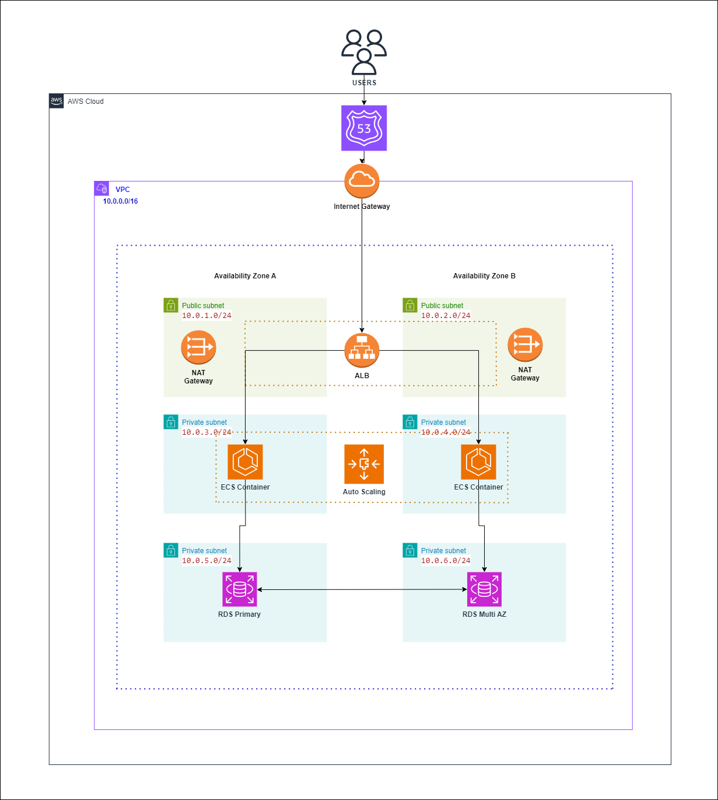
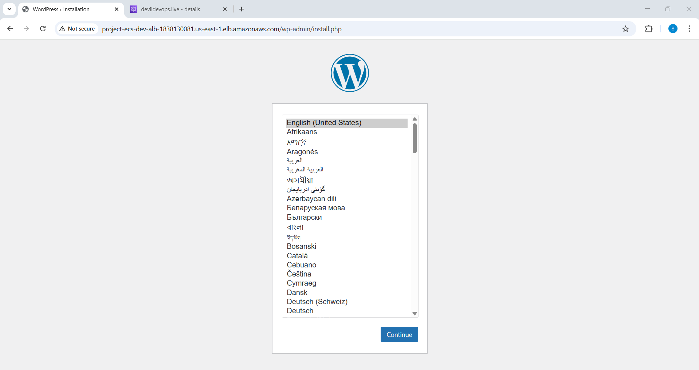

# Deploying a Scalable WordPress Application on AWS ECS with Terraform



## Overview
This project demonstrates how to deploy a scalable WordPress application on **AWS ECS (Elastic Container Service)** using **Terraform**. The infrastructure is designed to be highly available, secure, and scalable, following best practices for cloud deployment.

### **AWS Services Used:**
- **Amazon VPC**: A custom Virtual Private Cloud (VPC) with public and private subnets.
- **ECS (Elastic Container Service)**: Runs WordPress containers.
- **Application Load Balancer (ALB)**: Manages incoming traffic and distributes it across ECS containers.
- **RDS (Relational Database Service)**: MySQL database with Multi-AZ for high availability.
- **Route 53**: For domain name resolution.
- **NAT Gateway**: Allows private subnets to access the internet securely.
- **IAM Roles & Security Groups**: For access control and security.


## **Prerequisites**
- **Terraform** installed on your machine.
- **AWS CLI** configured with appropriate IAM permissions.
- **Docker** installed for containerization.
- **An Amazon Route 53 registered domain** (optional but recommended).

## **Setup and Deployment**
### **1. Clone the Repository**
```sh
 git clone https://github.com/saurabhshende13/Deploying-a-Scalable-WordPress-Application-on-AWS-ECS-with-Terraform.git
 cd Deploying-a-Scalable-WordPress-Application-on-AWS-ECS-with-Terraform
```

### **2. Initialize Terraform**
```sh
 terraform init
```

### **3. Plan the Infrastructure**
```sh
 terraform plan
```

### **4. Deploy the Infrastructure without ECS Initially**
```sh
 terraform apply -auto-approve
```

### **5. Deploy the ECS Cluster**
```sh
 cd Deploying-a-Scalable-WordPress-Application-on-AWS-ECS-with-Terraform/ecs/
 terraform apply -auto-approve
```


### **5. Retrieve the Load Balancer DNS Name**
```sh
 terraform output alb_dns_name
```
Use the provided DNS to access the WordPress application.



## **Destroying the Infrastructure**
To remove all created AWS resources:
```sh
 terraform destroy -auto-approve
```

## **Folder Structure**
```
.
├── modules/                
│   ├── alb                 # Application Load Balancer setup
│   ├── network             # VPC, subnets, NAT,
│   ├── rds                 # MySQL database setup
│   ├── security            # Security Group setup
├── ecs                     # Main Terraform configuration (Install ECS from here)
├── main.tf                 # ECS configuration
├── variables.tf            # Input variables for Terraform
├── outputs.tf              # Outputs for Terraform
└── README.md               # Documentation
```

## **Security Considerations**
- Uses **IAM roles** and **least privilege access** for ECS and RDS.
- Security groups allow access only to necessary ports.
- Database credentials are stored securely (consider using AWS Secrets Manager).

## **Future Enhancements**
- Automate CI/CD deployment using **GitHub Actions / AWS CodePipeline**.
- Implement **Amazon ElastiCache (Redis)** for performance optimization.
- Set up **CloudWatch Logs and Alarms** for better monitoring.

## **Contributing**
Feel free to open an issue or submit a pull request for improvements.

## **License**
MIT License. See `LICENSE` for details.

